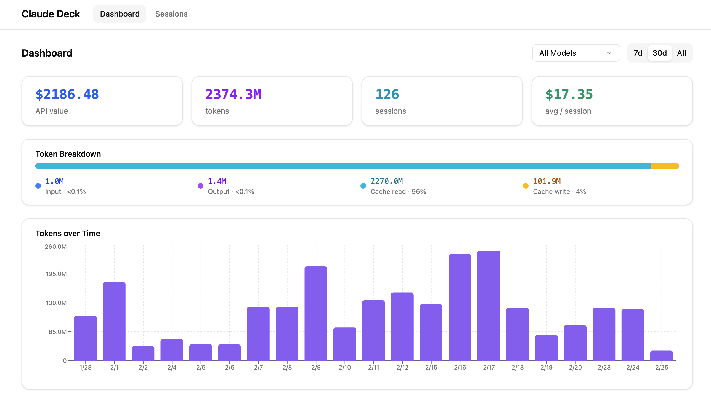

# claude-deck

Observability dashboard for Claude Code sessions.

[](https://www.npmjs.com/package/claude-deck)



## Quick Start

```
npx claude-deck
```

That's it. Syncs your sessions, starts the dashboard, and opens your browser.

## What It Does

- **Parses** Claude Code session data from `~/.claude/projects/`
- **Stores** everything in a local SQLite database
- **Serves** a web dashboard with sessions, tool calls, token usage, costs, and subagents
- **Tracks** per-model breakdowns, per-project stats, and top tools used

## CLI Reference

### `claude-deck`

Start the dashboard server.

| Flag | Description | Default |
|------|-------------|---------|
| `--port <number>` | Server port | `7722` |
| `--claude-dir <path>` | Override `~/.claude` directory | `~/.claude` |
| `--db <path>` | Override database path | `~/.claude-deck/data.db` |
| `--no-open` | Don't open browser automatically | |
| `--version` | Print version | |
| `--help` | Print help | |

### `claude-deck sync`

Sync session data without starting the server.

```
claude-deck sync [--claude-dir <path>] [--db <path>]
```

### `claude-deck stats`

Print aggregate statistics to the terminal.

```
claude-deck stats [--days <number>] [--project <name>]
```

| Flag | Description | Default |
|------|-------------|---------|
| `--days <number>` | Limit to last N days | `30` |
| `--project <name>` | Filter by project name | |

## Development

```bash
git clone https://github.com/gypsum-org/claude-deck.git
cd claude-deck
npm install
npm run dev
```

Requires Node.js >= 18.

| Script | Description |
|--------|-------------|
| `npm run dev` | Server + UI in watch mode |
| `npm run dev:server` | Server only (watch) |
| `npm run dev:ui` | UI only (dev) |
| `npm run build` | Production build |
| `npm run format` | Format with Prettier |

## License

[Apache-2.0](LICENSE)
